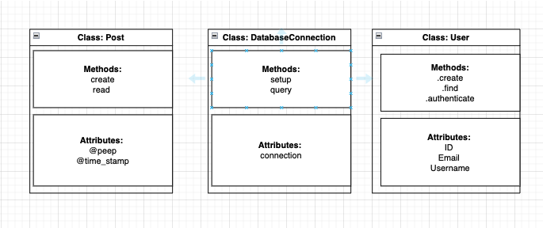
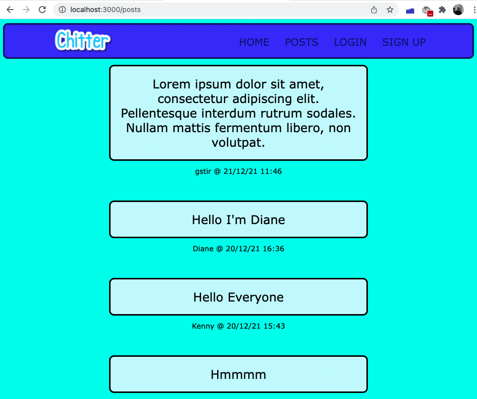
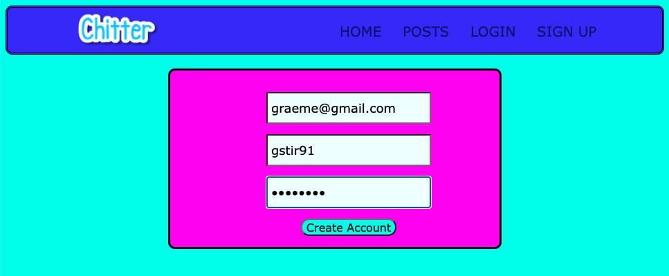
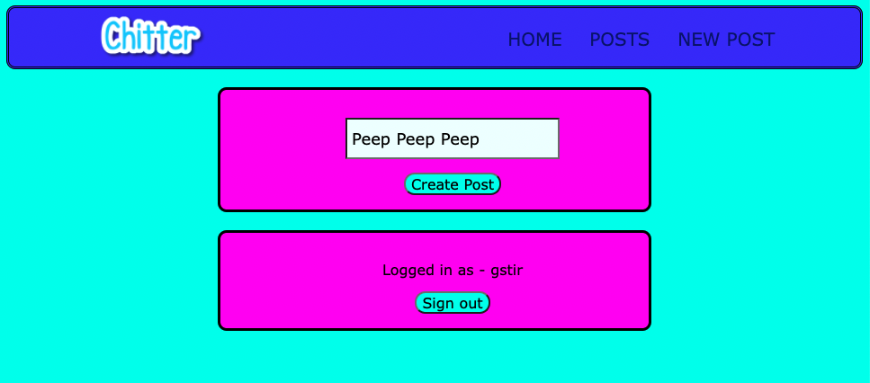

# Chitter: A Twitter style Clone

## Description

This is a clone of the popular CRUD application Twitter. User can sign up, login, create posts and see previously made posts stored on a local SQL database. User must have an account to login but does not need an account to view posted peeps.

## Planning 

### Domain Model 



#### User Stories 
```
As a Maker
So that I can see whats on peoples minds
I want to visit a page where peeps are made
```


```
As a Maker
So that I can post messages on Chitter as me
I want to sign up for Chitter 
```


```
As a Maker
So that I can post messages on Chitter
I want to make a new 'peep'
```


```
As a Maker 
So I can keep my account Secure 
I'd like to log out 
```


## Installation Instructions: 

Install ruby 2.7.3 <br>
```brew install ruby 2.7.3```

Clone the project into a directory using <br>
```git clone https://github.com/gjstirling/Chitter.git```

Install required gems <br>
```bundle install```

### Set up the database
----
**Create Databases**
- Install and set up psql if required (Homebrew: brew install postgresql).
- Connect to psql via the Terminal
- Create the databases using the psql commands found inside db/database_installation.sql <br>

**Import tables**
- Connect to the development database using the pqsl command <br>
```\c chitter;```
- Sequentially run the queries saved in the db/migrations directory.<br> 
- Connect to the test database using the psql command <br> 
```\c chitter_test;```
- Run queries saved inside db/migrations directory. 

---
### Usage Instructions

- Start server using ```rackup -p 3000```
- Visit http://localhost:3000/ in your browser
- Click 'sign_up' 
- Enter your details into the form 
- You can now login by clicking 'Login'
- Posts can be viewed or added 
- At the end of the session click 'sign_out' to end the session

## Technologies used

Ruby, RSpec, Sinatra, Capybara, HTML and Postgresql

## Testing/linting
**Enter these commands into command line inside the main directory:**

For testing <br>
```rspec``` <br>

For linting enter  
```rubocop```

### Features to add
Add Delete feature <br>
Add update feature <br>
Check for existing accounts email/usernames when signing up <br>
